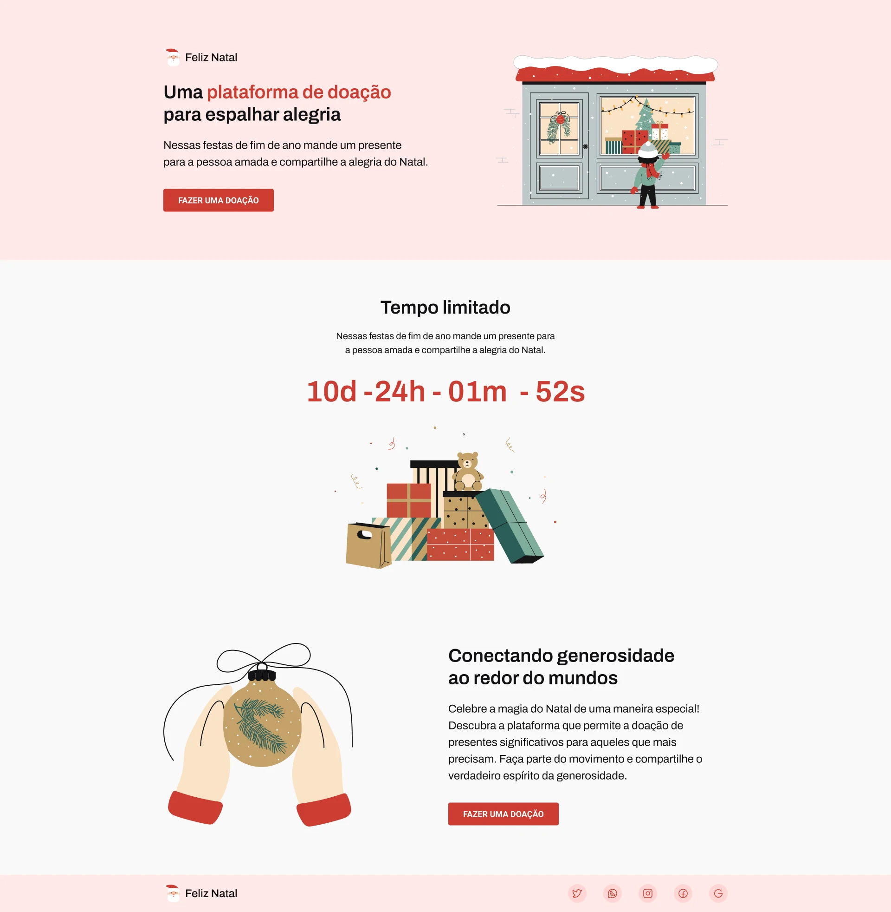

<h1 align="center">
  
 Natal Solidário
</h1>

Que tal ser um presente no Natal de uma criança? Acesse a página do Natal Solidário e contribua.

Acesse o site do <a href="https://natal-solidario-app.vercel.app/" target="_blank">Natal Solidário</a>.

 <a href="#Descrição">Descrição</a> •
 <a href="#Tecnologias">Tecnologias utilizadas</a> •
 <a href="#autor">Autor</a>

---

 

<h1 align="center">  
  

    

 
<h1 align="center">  
  

    

</h1>

### Descrição

O projeto consiste em um projeto natalino do <a href="https://vainaweb.com.br/" target="_blank">Vai Na Web</a> onde foi proposto criar um site **responsivo** com o objetivo de contribuir para um natal inesquecível para milhares de crianças.

### Tecnologias utilizadas

As seguintes ferramentas foram usadas na construção do projeto:

- HTML5
- CSS3
- Javascript

---

### Autor

Made with 💜 by Renan Cesar 👋

